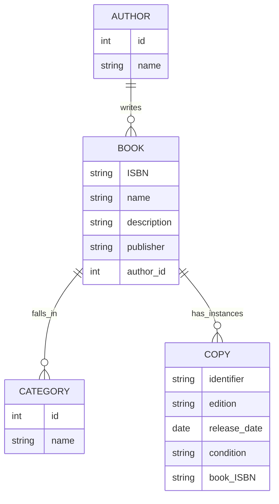

# labs-tests

## Database Model

## API Endpoints

### Authors
- **GET /authors/**: Get list of authors
- **POST /authors/**: Create a new author

### Books
- **GET /books/**: Get list of books
- **POST /books/**: Create a new book

### Categories
- **GET /categories/**: Get list of categories
- **POST /categories/**: Create a new category

### Copies
- **GET /copies/**: Get list of copies
- **POST /copies/**: Create a new copy

